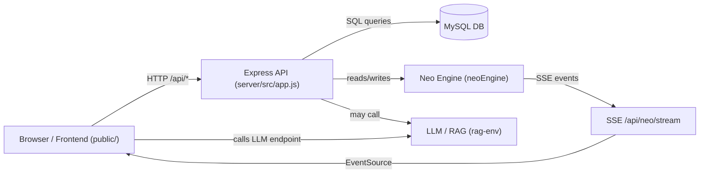

# 프로젝트 개요 (PROJECT_OVERVIEW)

## 목차
- [1. 한줄 요약](#1-한줄-요약)
- [2. 배경](#2-배경)
- [3. 주요 기능](#3-주요-기능)
- [4. 디렉터리 구조 & 파일 역할](#4-디렉터리-구조--파일-역할중요-파일-중심)
- [5. 데이터베이스(사용되는 테이블 요약)](#5-데이터베이스사용되는테이블-요약)
- [Database Schema (tables.sql)](#database-schema-tablesql)
- [11. 다이어그램](#11-다이어그램)

## 1. 한줄 요약
- 브라우저 기반 SPA로 자산(아데나) 추적, 히스토리 차트, OCO/계산기, 배경음악·배경 이미지, AI 보조 팝업(로그 분석)을 제공하는 개인용 대시보드입니다.

## 2. 배경
- 개인 자산(또는 모의 자산) 변동을 일별로 기록하고, 저장 시 보너스(아데나)를 지급하는 용도의 도구입니다.
- 프론트엔드에서 API 서버를 자동 탐지하여 DB와 동기화합니다.
- Neo 모듈은 별도의 가상 시간/엔진을 통해 이벤트와 SSE 기반 실시간 피드를 제공합니다.

## 3. 주요 기능
# 프로젝트 개요 (PROJECT_OVERVIEW)

## 1. 한줄 요약
- 브라우저 기반 SPA로 자산(아데나) 추적, 히스토리 차트, OCO/계산기, 배경음악·배경 이미지, AI 보조 팝업(로그 분석)을 제공하는 개인용 대시보드입니다.

## 2. 배경
- 개인 자산(또는 모의 자산) 변동을 일별로 기록하고, 저장 시 보너스(아데나)를 지급하는 용도의 도구입니다.
- 프론트엔드에서 API 서버를 자동 탐지하여 DB와 동기화합니다.
- Neo 모듈은 별도의 가상 시간/엔진을 통해 이벤트와 SSE 기반 실시간 피드를 제공합니다.

## 3. 주요 기능
- DB에서 `history`를 읽어 차트·테이블로 표시
- 오늘 값 저장(덮어쓰기) 및 보너스(수익의 10%) 적용 후 `adena` 증가
- 배경 이미지(`bglist`) / 배경음악(`bgmusic`)을 DB에서 읽어 UI 반영
- `chat_log` 저장 및 AI 팝업에서 로그를 불러와 질의 응답 또는 UI 오픈 실행
- Neo 엔진: 가상 시계·이벤트 로그 + SSE 스트리밍

## 4. 디렉터리 구조 & 파일 역할(중요 파일 중심)
- `public/` — 클라이언트 정적 파일 (빌드 결과 혹은 소스)
  - `index.html` — 진입 HTML
  - `assets/styles/*.css` — 기본 스타일
  - `src/main.js` — 앱 초기화, UI 연결, 상태 관리, 각 기능(Feature) 인스턴스 생성
  - `src/app/aiPopup.js` — AI 팝업(로그 기반 분석 + LLM 호출), UI 액션(runTool) 주입 포인트 존재
  - `src/app/api.js` — 프론트용 API 헬퍼 (API origin 탐지, `/api/*` 호출 래퍼)
  - `src/app/dbFlow.js` — DB 동기화 흐름: `reloadFromDB`, `saveTodayToDB`, 아데나 적용 큐 등
  - `src/features/history.js` — 히스토리 모달, 차트 렌더링, 코멘트 CRUD(서버 API 연동)
  - `src/ui/modal.js` — 모달 공통 UI(열기/닫기/스타일 보정)
  - 기타 `features/*`, `ui/*`, `app/*` — 각각의 UI/유틸/기능 모듈

- `server/` — 간단한 Express API 서버 + Neo 엔진
  - `server/src/app.js` — Express 앱, API 라우트( `/api/adena`, `/api/history`, `/api/chat_log`, `/api/neo/*` 등), Neo 엔진 초기화 및 라우터 마운트
  - `server/src/db.js` — MySQL 연결 풀 설정 (`pool`) — .env로 DB 설정
  - `server/src/neo/neoEngine.js` — Neo 엔진 로직(타이머, 이벤트 발생, 로그 기록)
  - `server/src/neo/neoRepo.js` — neo_state / neo_log DB 읽기/쓰기 헬퍼
  - `server/src/neo/neoRouter.js` — Neo 관련 API 및 SSE 스트림 엔드포인트
  - `server/src/api/*.js` — (프로젝트에 따라) adena/history 라우터 분리된 파일들

- `data/` — 로컬 데이터(예: `chatlog.json`) 및 기본값
- `rag-env/` — Python 가상환경(LLM/RAG 관련 도구 설치용으로 보임)
- 루트: `app.py`, `ingest_*.py` 등 RAG/ingest 관련 스크립트 존재 가능

## 5. 데이터베이스(사용되는 테이블 요약)
- `history` — (TS, AMOUNT, PNL, id) : 메인 일별 기록
  - 서버에서 `TS` 출력은 항상 `YYYY-MM-DD` 형식으로 내려줌
  - `POST /api/history/today` — 오늘 값 업서트(덮어쓰기)
- `adena` 또는 설정 기반 테이블(`settings`/`config`/`kv`) — 현재 아데나(포인트) 저장
- `chat_log` — 사용자가 입력한 채팅 로그 저장(검색/최근 불러오기)
- `bgmusic`, `bglist` — 미디어(경로) 목록을 문자열 컬럼으로 저장
- Neo 관련: `neo_state`, `neo_log`

## Database Schema (tables.sql)
아래는 `tables.sql`에 정의된 주요 테이블의 컬럼/타입/제약 및 간단 설명을 마크다운 표로 정리한 것입니다.

### `adena`
| Column | Type | Nullable | Constraint / Extra | Description |
|---|---:|:---:|---|---|
| id | TINYINT UNSIGNED | NO | PK, CHECK(id=1) | 싱글톤 ID (항상 1) |
| amount | DECIMAL(18,8) | NO |  | 현재 아데나(포인트) 값 |
| updated_at | TIMESTAMP | NO | DEFAULT CURRENT_TIMESTAMP ON UPDATE | 최종 갱신 시간 |

### `bgmusic`
| Column | Type | Nullable | Constraint / Extra | Description |
|---|---:|:---:|---|---|
| id | BIGINT UNSIGNED | NO | PK, AUTO_INCREMENT | 레코드 ID |
| filename | VARCHAR(255) | NO | UNIQUE | 파일 경로/이름 |
| sort_order | INT UNSIGNED | NO | DEFAULT 1 | 재생 순서 |
| is_enabled | TINYINT(1) | NO | DEFAULT 1 | 활성화 플래그 |
| created_at | TIMESTAMP | NO | DEFAULT CURRENT_TIMESTAMP | 생성 시각 |
| updated_at | TIMESTAMP | YES | ON UPDATE CURRENT_TIMESTAMP | 갱신 시각 |

### `bglist`
| Column | Type | Nullable | Constraint / Extra | Description |
|---|---:|:---:|---|---|
| id | BIGINT UNSIGNED | NO | PK, AUTO_INCREMENT | 레코드 ID |
| filename | VARCHAR(255) | NO | UNIQUE | 이미지 경로 |
| sort_order | INT UNSIGNED | NO | DEFAULT 1 | 표시 순서 |
| is_enabled | TINYINT(1) | NO | DEFAULT 1 | 활성화 여부 |
| created_at | TIMESTAMP | NO | DEFAULT CURRENT_TIMESTAMP | 생성 시각 |
| updated_at | TIMESTAMP | YES | ON UPDATE CURRENT_TIMESTAMP | 갱신 시각 |

### `history`
| Column | Type | Nullable | Constraint / Extra | Description |
|---|---:|:---:|---|---|
| id | BIGINT UNSIGNED | NO | PK, AUTO_INCREMENT | 레코드 ID |
| ts | DATE | NO | UNIQUE, KEY | 기록 날짜 (YYYY-MM-DD)
| amount | DECIMAL(18,2) | NO |  | 금액(예: USDT) |
| pnl | DECIMAL(18,2) | NO | DEFAULT 0 | 전일 대비 PNL (%) 또는 절대값 |
| created_at | TIMESTAMP | NO | DEFAULT CURRENT_TIMESTAMP | 생성 시각 |

### `history_comment`
| Column | Type | Nullable | Constraint / Extra | Description |
|---|---:|:---:|---|---|
| id | BIGINT UNSIGNED | NO | PK, AUTO_INCREMENT | 코멘트 ID |
| history_id | BIGINT UNSIGNED | NO | FK → history(id) ON DELETE CASCADE | 대상 히스토리 ID |
| body | LONGTEXT | NO |  | 코멘트 본문 |
| created_at | TIMESTAMP | NO | DEFAULT CURRENT_TIMESTAMP | 생성 시각 |
| updated_at | TIMESTAMP | YES | ON UPDATE CURRENT_TIMESTAMP | 갱신 시각 |

### `chat_log`
| Column | Type | Nullable | Constraint / Extra | Description |
|---|---:|:---:|---|---|
| id | BIGINT UNSIGNED | NO | PK, AUTO_INCREMENT | 레코드 ID |
| created_at | DATETIME | NO | DEFAULT CURRENT_TIMESTAMP | 생성 시각 |
| message | TEXT | NO |  | 사용자가 입력한 채팅 원문 |

### `rag_doc`
| Column | Type | Nullable | Constraint / Extra | Description |
|---|---:|:---:|---|---|
| id | BIGINT UNSIGNED | NO | PK, AUTO_INCREMENT | 문서 ID |
| source_type | VARCHAR(50) | NO |  | 원본 타입 (e.g., history_comment, chat_log) |
| source_id | BIGINT UNSIGNED | NO |  | 원본 테이블의 PK |
| title | VARCHAR(255) | YES |  | 문서 제목(옵션) |
| content | LONGTEXT | NO |  | 원문 텍스트 |
| meta_json | JSON | YES |  | 메타데이터 |
| created_at | TIMESTAMP | NO | DEFAULT CURRENT_TIMESTAMP | 생성 시각 |
| updated_at | TIMESTAMP | YES | ON UPDATE CURRENT_TIMESTAMP | 갱신 시각 |

### `rag_chunk`
| Column | Type | Nullable | Constraint / Extra | Description |
|---|---:|:---:|---|---|
| id | BIGINT UNSIGNED | NO | PK, AUTO_INCREMENT | 청크 ID |
| doc_id | BIGINT UNSIGNED | NO | FK → rag_doc(id) ON DELETE CASCADE | 소속 문서 ID |
| chunk_no | INT UNSIGNED | NO | UNIQUE(doc_id, chunk_no) | 청크 번호 |
| content | TEXT | NO |  | 청크 텍스트 |
| embedding_json | JSON | NO |  | 임베딩 벡터(JSON) |
| token_count | INT UNSIGNED | YES |  | 토큰 수 (옵션) |
| created_at | TIMESTAMP | NO | DEFAULT CURRENT_TIMESTAMP | 생성 시각 |

### `neo_state`
| Column | Type | Nullable | Constraint / Extra | Description |
|---|---:|:---:|---|---|
| id | INT | NO | PK (보통 1) | 스냅샷 ID |
| anchor_real_ms | BIGINT | NO |  | 앵커 현실 ms |
| anchor_system_min | INT | NO |  | 앵커 시스템 분 |
| last_real_ms | BIGINT | NO |  | 마지막 현실 ms |
| last_system_min | INT | NO |  | 마지막 시스템 분 |
| system_day | INT | NO |  | 시스템 일자 |
| system_hour | TINYINT | NO |  | 시스템 시 |
| system_minute | TINYINT | NO |  | 시스템 분 |
| life_no | INT | NO |  | 환생/생명 번호 |
| age_years | INT | NO |  | 나이(연도) |
| day_in_life | INT | NO |  | 개월(생애 내) |
| status | VARCHAR(24) | NO |  | 상태 문자열 |
| location | VARCHAR(120) | NO |  | 위치명 |
| last_thought | TEXT | YES |  | 마지막 생각 |
| last_action | TEXT | YES |  | 마지막 행동 |
| last_boundary_system_day | INT | NO | DEFAULT 1 | 일 경계 중복 방지용 |
| last_event_system_min | INT | NO | DEFAULT 0 | 이벤트 중복 방지용 |
| updated_at | TIMESTAMP | NO | DEFAULT CURRENT_TIMESTAMP ON UPDATE | 갱신 시각 |

### `neo_log`
| Column | Type | Nullable | Constraint / Extra | Description |
|---|---:|:---:|---|---|
| id | BIGINT | NO | PK, AUTO_INCREMENT | 로그 ID |
| real_ms | BIGINT | NO |  | 현실 ms |
| system_min | INT | NO |  | 시스템 분 수치 |
| system_day | INT | NO |  | 시스템 일 |
| system_hour | TINYINT | NO |  | 시스템 시 |
| system_minute | TINYINT | NO |  | 시스템 분 |
| life_no | INT | NO |  | 생명 번호 |
| age_years | INT | NO |  | 나이(연도) |
| day_in_life | INT | NO |  | 개월(생애 내) |
| kind | ENUM | NO | ('SYSTEM','THOUGHT','MOVE','STATUS') | 이벤트 종류 |
| status | VARCHAR(24) | NO |  | 상태 문자열 |
| location_from | VARCHAR(120) | YES |  | 이동 전 위치 |
| location_to | VARCHAR(120) | YES |  | 이동 후 위치 |
| message | TEXT | NO |  | 메시지 내용 |
| created_at | TIMESTAMP | NO | DEFAULT CURRENT_TIMESTAMP | 생성 시각 |

참고: `tables.sql`에 포함된 제약(CHECK, UNIQUE, FOREIGN KEY)과 예시 INSERT 문들은 초기 데이터/무결성 확보에 도움이 됩니다. DB가 없거나 스키마가 다르면 서버는 일부 자동 탐지 로직을 사용하지만, 테이블 생성이 권장됩니다.


> 참고: 서버는 자동으로 사용 가능한 테이블/칼럼을 탐지하도록 여유 있게 설계되어 있습니다. 필요하면 `.env`에서 `ADENA_TABLE`/`ADENA_COLUMN` 등을 지정하세요.

## 6. 환경변수(.env 주요 키)
- `DB_HOST`, `DB_PORT`, `DB_USER`, `DB_PASSWORD`, `DB_NAME` — MySQL 접속
- `PORT` — 서버 포트(기본 6431)
- `ADENA_TABLE`, `ADENA_COLUMN` — 아데나 읽기/쓰기 강제 지정
- `NEO_REAL_MS_PER_SYSTEM_DAY`, `NEO_CHECKPOINT_MIN` — Neo 엔진 조정

## 7. 개발 & 실행 가이드 (간단)
- MySQL 세팅 후 `.env` 파일 준비
- 서버 실행 (예시): `node server/src/app.js` 또는 프로젝트의 `package.json` 스크립트 사용
- 브라우저에서 `http://localhost:6431` 접속
- 프론트엔드가 API를 자동탐지하고 `db.reloadFromDB(true)`를 호출하여 초기화 시도

## 8. 주요 디버깅 포인트
- AI 팝업(`src/app/aiPopup.js`)이 `history`를 전달 못 하는 경우 확인 항목:
  - 브라우저 DevTools 네트워크에서 `/api/all` 또는 `/api/history` 응답 내용 확인
  - 서버 콘솔에 MySQL 연결 오류 또는 `DB 초기 로드 실패` 로그 확인 (`server/src/app.js`의 서버 시작 로그)
  - `history` 배열이 클라이언트 상태에 정상적으로 내려와 `createHistoryModal`로 전달되는지(프론트 `main.js`의 `onOpenHistory` 호출시 상태 체크)
- DB 테이블이 없으면 API는 빈 배열을 반환하거나 500 에러 메시지를 줍니다(테이블 생성 필요).

## 9. 향후 수정 시 참고 (너를 위한 포인트)
- UI에서 데이터가 보이지 않을 때: `apiGetAllTables()` → `apiGetAllTablesSplit()` 호출 흐름을 추적하면 어떤 API가 실패했는지 빠르게 알 수 있음.
- `history` 관련 코드는 `server/src/app.js`(읽기/쓰기)와 `public/src/features/history.js`(모달/렌더링)가 핵심입니다.
- AI 관련 흐름: `public/src/app/aiPopup.js` -> `public/src/app/api.js`의 `apiSearchChatLog`/`apiGetChatLogRecent` -> 서버 `/api/chat_log`.

## 10. 빠른 체크리스트
- [ ] MySQL 접속 정보(.env) 확인
- [ ] `history`, `chat_log`, `neo_state`, `neo_log` 등 테이블 존재 여부 확인
- [ ] 서버 로그에 에러가 있는지 확인
- [ ] 브라우저에서 네트워크 응답(JSON 형식 확인)

---
파일 경로: `PROJECT_OVERVIEW.md`

원하시면 이 파일을 `docs/`로 옮기거나, 항목별(예: `DB.md`, `FRONTEND.md`, `NEO.md`)로 분리하여 더 상세하게 만들어 드리겠습니다.

## 11. 다이어그램
아래 다이어그램은 Mermaid 문법을 사용했습니다. (일부 마크다운 뷰어/렌더러에서 Mermaid 지원이 필요합니다.)

### 11.1 아키텍처 개요


### 11.2 저장(오늘 값) 흐름 (Sequence)
```mermaid
sequenceDiagram
  participant UI as Browser UI
  participant API as /api/history/today
  participant DB as MySQL

  UI->>API: POST { amount }
  API->>DB: DELETE existing where TS = today; INSERT new (TS, AMOUNT, PNL)
  API->>DB: read adena source / update adena (bonus 지급 시)
  DB-->>API: { history, adena, bonus }
  API-->>UI: JSON { history, adena, bonus }
```

### 11.3 전체 디렉터리 구조
```
sparta-site/
├─ .gitignore
├─ Angel_Protocol_본문.pdf
├─ APP.py
├─ app.py
├─ ingest_pdf.py
├─ ingest_rag.py
├─ package.json
├─ package-lock.json
├─ procedures.txt
├─ price.json
├─ price copy.json
├─ PROJECT_OVERVIEW.md
├─ README.md
├─ tables.sql
├─ public/
│  ├─ index.html
│  ├─ assets/
│  │  └─ styles/
│  │     ├─ base.css
│  │     ├─ hud.css
│  │     ├─ modal.css
│  │     └─ orb.css
│  ├─ bgmusic/
│  │  ├─ 00_lineage.mp3
│  │  ├─ 01_Recluse.mp3
│  │  ├─ 02_The_Blood_Pledge.mp3
│  │  ├─ 03_Against_Odds.mp3
│  │  ├─ 04_A_New_Hope.mp3
│  │  ├─ 05_Under_Siege.mp3
│  │  ├─ 08_Man_of_Honor.mp3
│  │  ├─ 11_Your_Wish.mp3
│  │  ├─ 12_Eternally.mp3
│  │  ├─ 13_Vagabonds.mp3
│  │  ├─ 14_Moonlight.mp3
│  │  ├─ 15_If.mp3
│  │  ├─ 17_Town_All_Our_Wants.mp3
│  │  ├─ 19_Desperate Moment.mp3
│  │  ├─ Eve_Had_A_Dream_Neo(Combined_Mix).mp3
│  │  ├─ The_Skull_(Dance_Mix).mp3
│  │  └─ the_red_pill_proud_music_preview.mp3
│  ├─ bglist/
│  │  ├─ background_ep01_00.jpg
│  │  ├─ background_ep01_01.png
│  │  ├─ background_ep01_02.bmp
│  │  ├─ background_ep01_03.gif
│  │  ├─ background_ep01_04.png
│  │  ├─ background_ep01_05.jpg
│  │  ├─ background_ep01_06.jpg
│  │  ├─ background_ep01_07.png
│  │  ├─ background_ep01_08.png
│  │  ├─ background_ep01_09.jpg
│  │  ├─ background_ep01_10.png
│  │  ├─ matrix_ep01_00.gif
│  │  ├─ earn_money.gif
│  │  └─ loss_money.gif
│  ├─ data/
│  │  └─ chatlog.json
│  ├─ images/
│  │  └─ spartalogo.png
│  └─ src/
│     ├─ main.js
│     ├─ app/
│     │  ├─ aiPopup.js
│     │  ├─ api.js
│     │  ├─ busyIndicator.js
│     │  ├─ chatRotation.js
│     │  ├─ constants.js
│     │  ├─ dbFlow.js
│     │  ├─ dom.js
│     │  ├─ historyTool.js
│     │  ├─ llmChat.js
│     │  ├─ matrixTool.js
│     │  ├─ neoClient.js
│     │  └─ utils.js
│     ├─ features/
│     │  ├─ adenaTimer.js
│     │  ├─ audio.js
│     │  ├─ background.js
│     │  ├─ calculator.js
│     │  ├─ commands.js
│     │  ├─ gameWorld.js
│     │  ├─ history.js
│     │  ├─ ocoCalc.js
│     │  └─ sessionTimer.js
│     └─ ui/
│        ├─ menu.js
│        ├─ modal.js
│        └─ render.js
├─ rag-env/
│  ├─ pyvenv.cfg
│  ├─ bin/
│  │  ├─ python
│  │  ├─ pip
│  │  └─ transformers
│  └─ lib/
│     └─ python3.9/
├─ server/
│  ├─ package.json
│  ├─ package-lock.json
│  └─ src/
│     ├─ app.js
│     ├─ db.js
│     ├─ api/
│     │  ├─ adenaRouter.js
│     │  └─ historyRouter.js
│     └─ neo/
│        ├─ index.js
│        ├─ neoEngine.js
│        ├─ neoRepo.js
│        └─ neoRouter.js
```